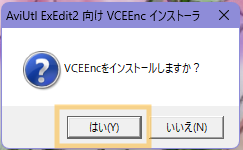
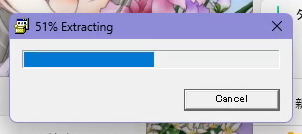

# VCEEnc  
by rigaya

[](https://github.com/rigaya/VCEEnc/actions/workflows/build_releases.yml)  [](https://github.com/rigaya/VCEEnc/actions/workflows/build_packages.yml)  

このソフトウェアは、AMDのGPU/APUに搭載されているHWエンコーダ(VCE/VCN)の画質や速度といった性能の実験を目的としています。  
Aviutlの出力プラグイン版と単体で動作するコマンドライン版があります。  

- [VCEEncC.exe](./Readme.ja.md)  
  単体で動作するコマンドライン版については、[こちら](./Readme.ja.md)を参照してください。

- VCEEnc.auo  
  AMDのVCE/VCNを使用してエエンコードを行う[Aviutl](http://spring-fragrance.mints.ne.jp/aviutl/)の出力プラグインです。本項で説明します。

## 配布場所 & 更新履歴
[こちら](https://github.com/rigaya/VCEEnc/releases)から、Aviutl_VCEEnc_x.xx.zipをダウンロードしてください。

## VCEEnc 使用にあたっての注意事項
無保証です。自己責任で使用してください。  
VCEEncを使用したことによる、いかなる損害・トラブルについても責任を負いません。

### AviUtl2 への導入・更新

ダウンロードしたexeファイルをダブルクリックして開きます。


インストールしますか? とでたら [はい] をクリックします。



自動的にアーカイブが展開され、インストールが開始されます。



VCEEncの動作に必要な追加モジュール(VC runtime)の導入が追加で必要な環境では、ユーザーアカウント制御画面が表示されます。
その場合は、 [はい] をクリックします。
_環境によっては準備が不要な場合があり、その場合は表示されません。_


下記のような画面になり、「VCEEnc を使用する準備が完了しました。」と出れば終了です。
ウィンドウを閉じ、AviUtl2を起動してVCEEncが追加されているか確認してください。


## VCEEnc の Aviutl への導入・更新

### ダウンロード

まず、VCEEncを[こちら](https://github.com/rigaya/VCEEnc/releases)からダウンロードします。

### 導入・更新

ダウンロードしたzipファイルをダブルクリックして開きます。中身はこんな感じです。


中身をすべてAviutlフォルダにコピーします。

> [!IMPORTANT]
> Aviutl2では、
> - exe_filesフォルダをAviutlフォルダの中に、
> - ```plugins```フォルダの**中身**を全て```C:\ProgramData\aviutl2\Plugin```の中に
>
> それぞれコピーしてください。


更新時には、下記のように上書きするか聞いてくることがあります。

その場合には「ファイルを置き換える」を選択して上書きしてください。


  
  
  
このあとAviutlをダブルクリックして起動してください。

初回起動時に必要に応じて下の図のようにVCEEncの使用準備をするというメッセージが出ます。環境によっては準備が不要な場合があり、その場合は表示されません。

OKをクリックすると使用準備が開始されます。


  
  
  
下の図のように、「この不明な発行元からのアプリがデバイスに変更を加えることを許可しますか?」というメッセージが表示されますので、「はい」をクリックしてください。


  
  
  
下の図のようなウィンドウが表示され、VCEEncの使用に必要なモジュールがインストールされます。

エラーなくインストールが完了すると下記のように表示されますので、右上の[x]ボタンでウィンドウを閉じてください。


これで使用準備は完了です。

### 確認

VCEEncがAviutlに認識されているか確認します。

Aviutlの [その他] > [出力プラグイン情報]を選択します。


VCEEnc が表示されていれば成功です。


### エンコード
[ ファイル ] > [ プラグイン出力 ] > [ 拡張 VCE 出力 (GUI) ] を選択し、出力ファイル名を入力して、「保存」をクリックしてください。


エンコードが開始されます。


エンコードが完了するまで待ちます。お疲れ様でした。


## 想定動作環境

### Windows
Windows 10/11 (x86/x64)  
Aviutl 1.00 以降 (VCEEnc.auo)  
VCEが載ったハードウェア  
  AMD製 GPU Radeon HD 7xxx以降  
  AMD製 APU Trinity世代(第2世代)以降  

| VCEEnc | 必要なグラフィックスドライバのバージョン |
|:---|:---|
| VCEEnc 3.00以降 | AMD ドライバ 17.1.1 (16.50.2611) 以降 |
| VCEEnc 5.00以降 | AMD ドライバ 19.7.1 以降 |
| VCEEnc 5.01以降 | AMD ドライバ 19.12.1 以降 |
| VCEEnc 5.02以降 | AMD ドライバ 20.2.1 以降 |
| VCEEnc 6.09以降 | AMD ドライバ 20.11.2 以降 |
| VCEEnc 6.13以降 | AMD ドライバ 21.6.1 以降 |
| VCEEnc 6.17以降 | AMD ドライバ 21.12.1 以降 |


## 使用出来る主な機能
#### VCEEnc/VCEEncC共通
- VCEを使用したエンコード
   - H.264/AVC
   - HEVC (Polaris以降)
- VCEEncの各エンコードモード
   - CQP       固定量子化量
   - CBR       固定ビットレート
   - VBR       可変ビットレート
- Level / Profileの指定
- 最大ビットレートの指定
- 最大GOP長の指定
- SAR比の設定
- colormatrix等の指定
- 参照距離の設定
- Bフレーム数の設定

#### VCEEnc (Aviutlプラグイン)
- 音声エンコード
- 音声及びチャプターとのmux機能
- 自動フィールドシフト対応

#### VCEEncC
- avs, vpy, y4m, rawなど各種形式に対応
- HWデコード
  - H.264
  - HEVC
  - MPEG2
  - VP9
  - VC-1
- HWリサイズ
- ソースファイルからの音声抽出や音声エンコード
- mp4,mkv,tsなどの多彩なコンテナに映像・音声をmuxしながら出力
- エンコード結果のSSIM/PSNRを計算
- GPUを使用した高速フィルタリング
  - OpenCLによるGPUフィルタリング
    - インタレ解除  
      - afs (自動フィールドシフト)
      - nnedi
    - 字幕焼きこみ
    - 色空間変換
      - hdr2sdr
    - リサイズ  
      - spline16, spline36, spline64
      - lanczos2, lanczos3, lanczos4
    - 回転 / 反転
    - パディング(黒帯)の追加
    - バンディング低減
    - ノイズ除去
      - knn (K-nearest neighbor)
      - pmd (正則化pmd法)
    - 輪郭・ディテール強調
      - unsharp
      - edgelevel (エッジレベル調整)
      - warpsharp

## マルチGPU環境でのGPU自動選択
VCEEncCでは、VCE/VCNを実行可能なGPUが複数存在する場合、
指定されたオプションをもとに実行時に最適なGPUを自動選択します。
自動選択に任せず、自分でGPUを選択する場合には--deviceオプションで指定してください。

1. 指定オプションを実行可能なGPUを選択  
  指定されたオプションから下記をチェックします。  
  - 指定されたコーデック、プロファイル、レベルのサポート
  - 下記を指定した場合、それをサポートしているかチェック
    - 10ビット深度
    - HWデコードのサポート (avhw指定時)
  
2. 指定オプションを満たすGPUを優先  
  下記条件のチェックし、実行可能なGPUを優先します。  
  - Bフレームの使用が指定された場合、Bフレームのサポート
  - --paが指定された場合、pre-analysisのサポート
  
3. 1と2の条件を満たすGPUが複数ある場合、下記条件をチェックしてGPUを自動選択します。  
  - Video Engine(VE)使用率の低いもの
  - GPU使用率の低いもの
  
  VE/GPU使用率の低いGPUで実行することで、複数のGPUを効率的に使用し、エンコード速度の最大限引き出します。
  
  なお、VE/GPU使用率の取得はエンコードの開始時に行われ、その値には数秒のタイムラグがあるため、
  エンコードをほぼ同時に複数開始すると、複数のエンコードが同じGPUに割り当てられてしまうことが
  多いのでご注意ください。

## VCEEnc の Aviutl からの削除

VCEEnc の Aviutl から削除するには、"plugins" フォルダ内の下記ファイルとフォルダを削除してください。

- [フォルダ] VCEEnc_stg
- [ファイル] VCEEnc.auo
- [ファイル] VCEEnc.conf (存在する場合のみ)
- [ファイル] VCEEnc(.ini)
- [ファイル] auo_setup.auf


## 多言語対応

現在、日本語、英語、中国語の切り替えに対応しています。

中国語については、Aviutlの中国語対応をされているNsyw様に翻訳いただきました。メッセージ量の多い中、ご対応いただき、ありがとうございました！

他の言語については、VCEEnc.auoと同じフォルダに下記2ファイルを置くことで、新たな言語を追加できます。

| ファイル名 | 翻訳元 |
|:---        |:---   |
| VCEEnc.<2文字の言語コード>.lng | VCEEnc.ja.lng |
| VCEEnc.<2文字の言語コード>.ini | VCEEnc.ja.ini |

いずれもUTF-8で保存してください。

## ソースコードについて
- MITライセンスです。
- 本ソフトウェアは[AMD Media Framework](https://github.com/GPUOpen-LibrariesAndSDKs/AMF)のサンプルコードをベースに作成されており、
  AMD Media Frameworkのソースを含みます。
  詳細は各ソースのヘッダ部分や、VCEEnc_license.txtをご覧ください。
- 本ソフトウェアでは、
  [ffmpeg](https://ffmpeg.org/),
  [tinyxml2](http://www.grinninglizard.com/tinyxml2/),
  [dtl](https://github.com/cubicdaiya/dtl),
  [clRNG](https://github.com/clMathLibraries/clRNG),
  [ttmath](http://www.ttmath.org/),
  [Caption2Ass](https://github.com/maki-rxrz/Caption2Ass_PCR)を使用しています。  
  これらのライセンスにつきましては、該当ソースのヘッダ部分や、VCEEnc_license.txtをご覧ください。

### ソース概要
Windows ... VCビルド  

文字コード: UTF-8-BOM  
改行: CRLF  
インデント: 半角空白x4
